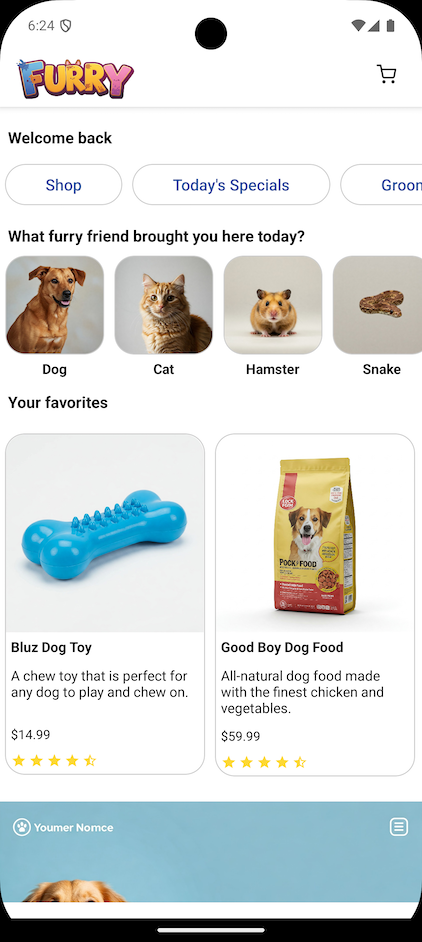
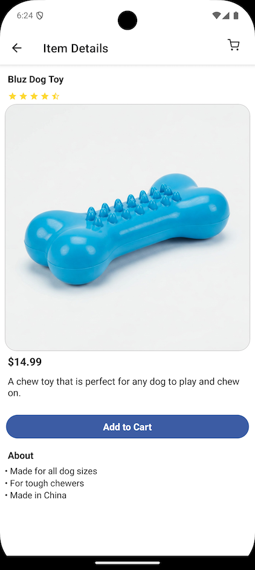
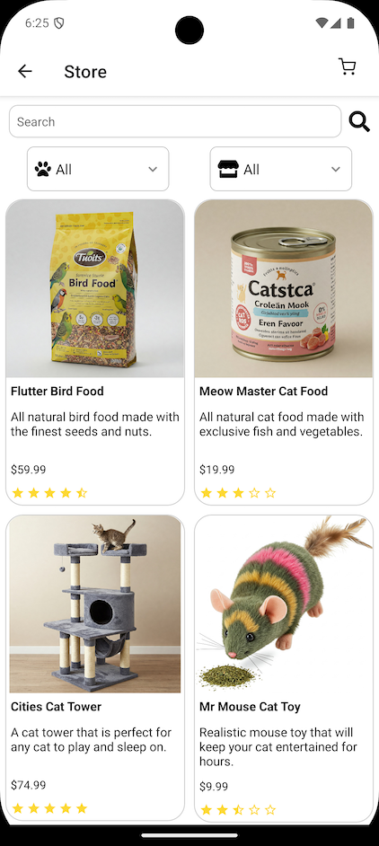
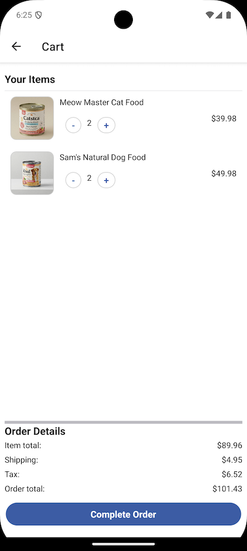
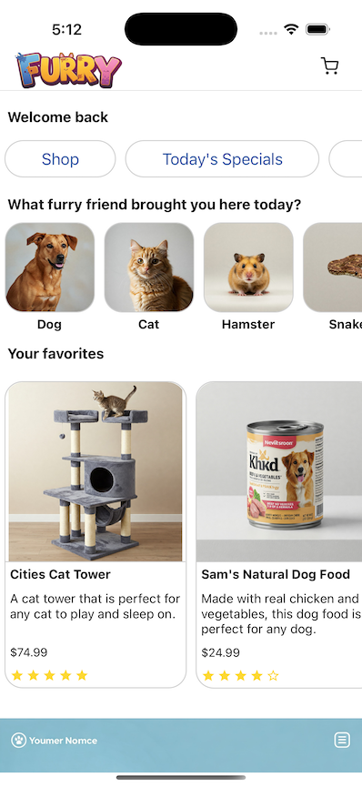
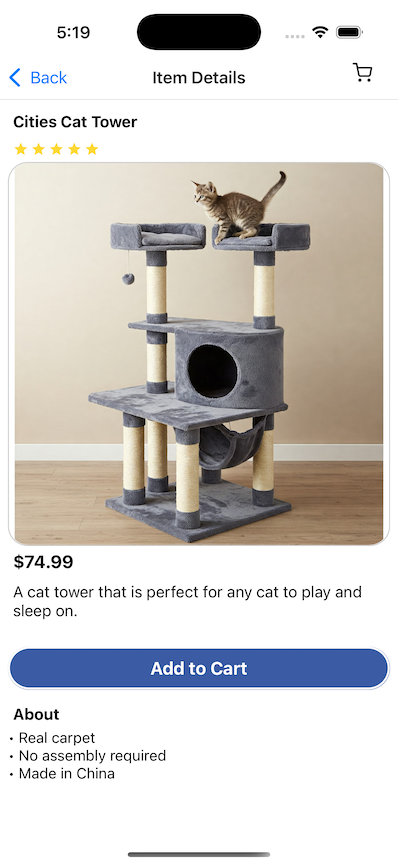
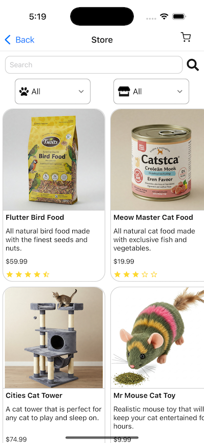
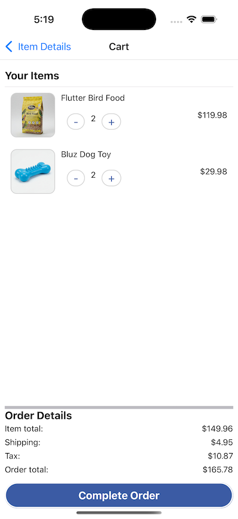

# Furry - React Native

This is a sample mobile app named `Furry`, a (very) basic pet store. This is not intended to be a complete application, but rather a starting point for a full application.

This is an [Expo](https://expo.dev) project created with [`create-expo-app`](https://www.npmjs.com/package/create-expo-app).

## Features

- Dashboard page
- List of store items with filtering
- Item detail page
- Cart page
- Item search

## Screenshots
#### Android





#### Android





## How to run

```bash
npm install
npm run android
npm run ios
```

## Running Tests
```bash
npm test
```

## Questions
#### What is the purpose of this project?
I created this project to demonstrate creating a simple mobile app in React Native.

I made one in [Flutter](https://github.com/noahcolvin/furry_flutter) and [Android](https://github.com/noahcolvin/furry-android) too!

#### Why isn't there much here?
This is just a starting point. I wanted to keep it simple and not include too many features. This is a good starting point for a full application.

#### This isn't very pretty
Sure, but also I'm not a designer. Rest assured, I will not be taking any design jobs.

#### Where is the backend?
There are a few, currently:

[Supabase/Node](https://github.com/noahcolvin/furry-backend)

[.NET](https://github.com/noahcolvin/furry-backend-dotnet)

[Express/Node](https://github.com/noahcolvin/furry-backend-express)

#### Why is there no authentication?
No need for the current app.

#### Code X is bad, why didn't you do Y?
This is just a sample exercise and was completed in a few days. I'm sure there are many improvements that could be made. Fell free to make an issue or PR if you have a suggestion. This doesn't need to be perfect but I am certainly open to feedback. I may add to it in the future.